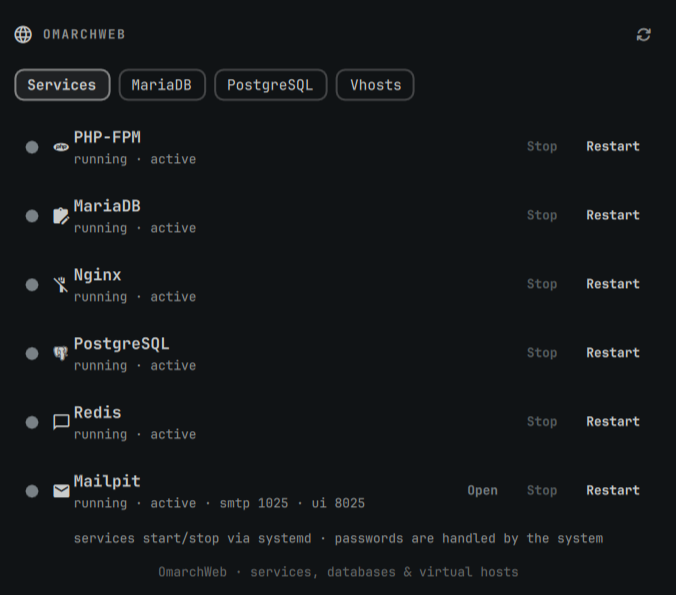

# OmarchWeb



A native Omarchy Quattro bar plugin for local web development: start/stop
services, manage MariaDB and PostgreSQL databases and users, and add Nginx
virtual hosts (PHP, Laravel, WordPress).

## Install

```sh
omarchy plugin add https://github.com/giodc/omarchweb.git --enable
```

Or from a local clone under `~/.config/omarchy/plugins/io.github.giodc.omarchweb/`:

```sh
omarchy plugin enable io.github.giodc.omarchweb right
```

Saved edits hot-reload. If a change does not apply:

```sh
omarchy-shell shell rescanPlugins
```

## Usage

Click the globe on the bar to open the panel. Escape closes it.

- **Services** — install, start, stop, restart, or uninstall PHP-FPM, MariaDB,
  Nginx, PostgreSQL, Redis, and Mailpit. Privileged actions use the desktop
  polkit agent (`pkexec`).
- **MariaDB / PostgreSQL** — tabs appear when that server is installed. Create
  and delete databases and password users for apps (e.g. WordPress).
- **Vhosts** — add PHP, Laravel, or WordPress sites. WordPress downloads
  pinned release 7.1 (SHA-256 verified) into the site folder. Each row has
  icons to open the site in a browser, the project folder, or a terminal in
  that folder.

Default panel tab is **Services**. The bar widget defaults to the **right**
section (`defaultSection`).

### Tune sites

After installing or updating OmarchWeb (or if PHP/WordPress permissions look
wrong), run **Tune sites** once from the Vhosts tab. That may ask for your
password. It:

- Installs/refreshes your per-user PHP-FPM pool so PHP runs as your user
- Rewires managed vhosts to that pool socket
- Reclaims leftover `http`-owned files under WordPress docroots
- Repairs nginx layout / path issues and reloads (or starts) nginx

From a terminal you can do the same with:

```sh
~/.config/omarchy/plugins/io.github.giodc.omarchweb/scripts/vhost.sh tune
```

Tune is idempotent — safe to run anytime after a plugin update.

### Laravel sites

OmarchWeb does **not** run `laravel new` for you (so you can pick a starter
kit). Adding a Laravel vhost creates an **empty** project folder and an nginx
vhost pointed at `public/`.

1. In the panel, add a vhost with type **laravel** (name e.g. `blog`).
2. Open the project folder or terminal from the vhost row (or:
   `cd ~/Web/blog`).
3. Scaffold the app yourself:

```sh
cd ~/Web/blog
laravel new .
# pick Vue / React / Livewire / none, database, etc. interactively

# or without the installer:
composer create-project laravel/laravel .
```

4. When `public/` exists, open the site (panel browser icon, or `web open`).

Requirements: Composer and the Laravel installer (full OmarchWeb **setup**
installs them). The project folder must stay empty until you run
`laravel new .`.

Until you scaffold, the URL may 404 — that is expected.

### CLI (`web` / `omarchweb`)

After full setup (or `scripts/cli.sh install-cli`), wrappers are installed to
`~/.local/bin`. Ensure that directory is on your `PATH`, then:

```sh
cd ~/Web/myapp
omarchweb open            # open this site's URL in the browser
web open                  # same

omarchweb url             # print URL only
omarchweb open wordpress  # open a named vhost from anywhere
omarchweb list            # list managed vhosts
omarchweb install-cli     # reinstall/refresh ~/.local/bin wrappers
```

`open` / `url` resolve the current directory to a managed vhost (for Laravel,
either the project root or `public/`).

Manual install if needed:

```sh
~/.config/omarchy/plugins/io.github.giodc.omarchweb/scripts/cli.sh install-cli
```

## Configure

```sh
omarchy bar move io.github.giodc.omarchweb --section right
omarchy bar set io.github.giodc.omarchweb refreshSeconds 30
omarchy bar set io.github.giodc.omarchweb webRoot ~/Web
omarchy bar set io.github.giodc.omarchweb nginxPort 80
```

| Key | Type | Default | Meaning |
| --- | --- | --- | --- |
| `refreshSeconds` | integer | 30 | How often to re-check service/db state while the panel is open |
| `webRoot` | path | `~/Web` | Base folder for new vhosts/projects |
| `nginxPort` | integer | 80 | Listen port for generated virtual hosts |

## Privileges

The first privileged action installs a reviewed snapshot of `scripts/root.sh`
to `/usr/local/libexec/omarchweb/root.sh` (root-owned, mode 0555). After that,
systemd control, package install/remove, nginx config, `/etc/hosts`, Mailpit
install, and database grants run that snapshot via passwordless `sudo` when
available, otherwise `pkexec`. The plugin checkout is never executed as root.

If you update the plugin, the next privileged action reinstalls the helper
when the digest no longer matches.

Every helper operation is narrowly defined: package, service, and PHP
extension names come from fixed allow-lists, `systemctl` takes exactly one
allow-listed unit, database grants pass only a validated role name (the SQL is
built inside the snapshot), a vhost document root must live under the calling
user's home, and `nginx-tune` derives that home from the authenticated caller
rather than an argument. There is no generic "run this as root" path.

## Tests

```sh
bash test/security.sh
```

These checks encode the marketplace privilege and supply-chain review
(root-owned helper, pinned artifacts, no generic root primitives). Run them
before resubmitting.

## Backends

Scripts in `scripts/` (not invoked as a second Quickshell process):

- `services.sh` — systemd status/start/stop/restart
- `db.sh` — MariaDB and PostgreSQL databases and app users
- `vhost.sh` — Nginx virtual hosts (pinned WordPress release)
- `cli.sh` — user CLI (`omarchweb` / `web`: open/url/list)
- `setup.sh` — install/uninstall stack packages (Mailpit from a pinned GitHub release)
- `root.sh` — allow-listed privileged helper (installed as a root-owned snapshot)
- `pins.sh` — reviewed versions and artifact digests

Environment overrides: `OMARCHWEB_SERVICES`, `OMARCHWEB_DB_BIN`,
`OMARCHWEB_PG_BIN`, `OMARCHWEB_WEB_ROOT`, `OMARCHWEB_NGINX_DIR`,
`OMARCHWEB_PORT`, `OMARCHWEB_FPM_SOCK`.

## IPC

```sh
omarchy-shell ipc call io.github.giodc.omarchweb toggle
omarchy-shell shell summon io.github.giodc.omarchweb '{}'
omarchy-shell shell hide io.github.giodc.omarchweb
```

## Remove

```sh
omarchy plugin remove io.github.giodc.omarchweb
```

Removing the plugin does not uninstall web services, virtual hosts, or the
root-owned helper at `/usr/local/libexec/omarchweb/root.sh`. To drop the
helper after removing the plugin:

```sh
sudo rm -f /usr/local/libexec/omarchweb/root.sh
sudo rmdir /usr/local/libexec/omarchweb 2>/dev/null || true
```

## License

MIT — see [LICENSE](LICENSE).
